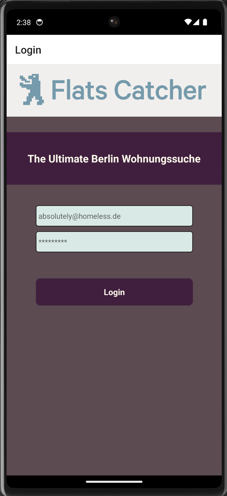
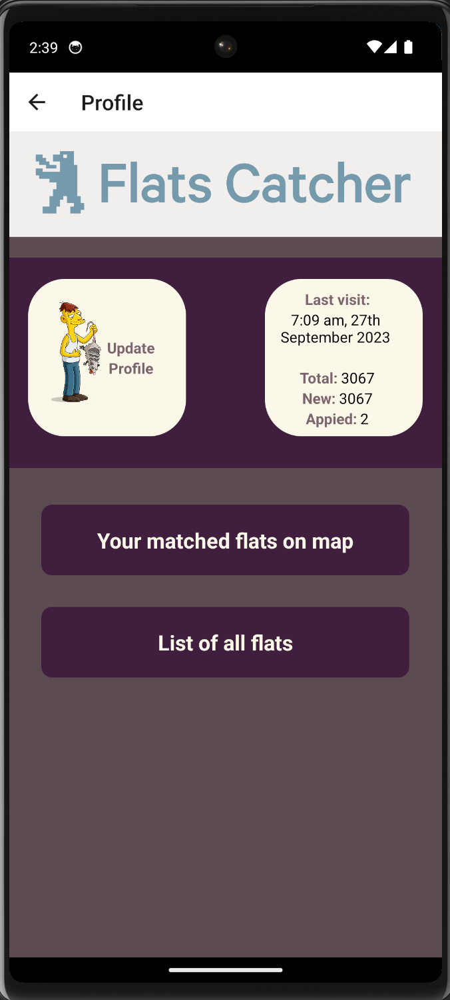
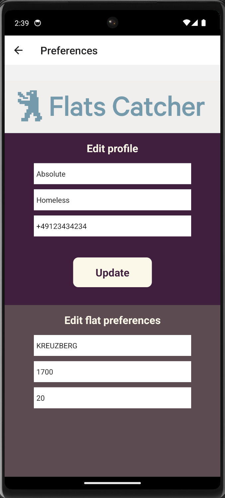
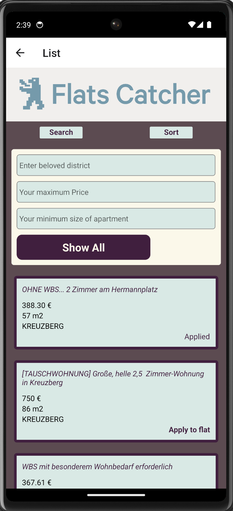
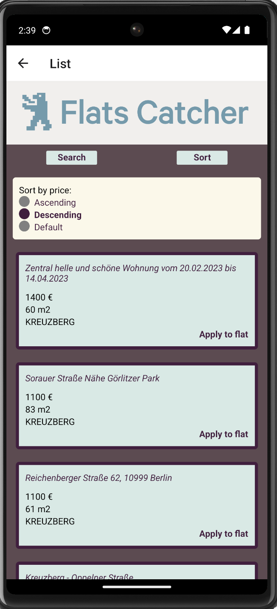
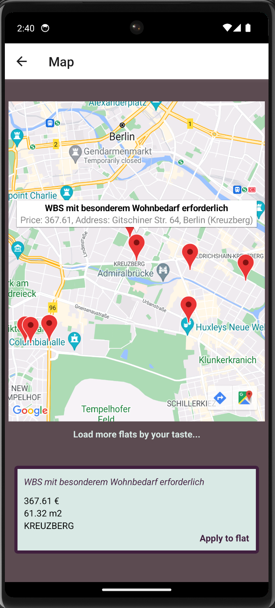

# Flatscatcher

This is an application for searching flats in Berlin. It provides list of actual flats, map, profile and preferences setup.
When you changing some data - stored procedures run at database and update a bunch of tables.

It contains _server_ side, _client_ side and _database_.

                    


                 

## Getting started

1. Clone this repo and enter!

```
git clone git@github.com:miklyx/Flatscatcher.git
cd Flatscatcher
```


## Backend

Backend built on _koa server_

Backend located inside _/server_ folder. To install dependencies run `npm i` command from it and then `nodemon index.js` to run your database.
Take a look at `controllers/index.js` file to find settings for your database connection.

## Frontend

Frontend built on _react native_ framework. To run it install dependencies from `/client` folder by running `npm i` command.
Then run `npm start` to start the app.

Scan QR code with expo application and explore application.

It's easy to see application in mobile app emulator - you will need to install _android studio_ with android phone simulator and/or _xcode_ with iphone simulator.


> [!NOTE]
> I would recommend you also have _Emulator_ extension installed in your VSCode.

Take a look inside `apiService.js` file to locate backend api URL - when you will run it in emulator this must be the value of a _gateway_ of your virtual network.


## Database

Database is provided in file `flatscatcher.sql` - this is a simple postgres dump file which can be restored to your database.
It contains _schema_ with needed _tables_, stored _functions_ to run this app.

## Underwater part

> [!WARNING]
> This app uses a data gathered by another app - it parses immobilienscout24, > > > kleinanzeigen, wg-gesucht and immowelt for new appartments and sends it to local > sqlite and to telegram messenger. Underwater part contains prepare of that data > and push it into `clear` table in DB of app. This one for now is broken,
> but if you are ready to parse this websites or another and push data to bd - fix > the data flow - this would be nice.

## Tips and flow

> [!NOTE]
> Inside code I've made some comments `TECH DEBT` - for functional to be improved.

Another comments in code for your comfort.

In beginning database contains lack of data - there is a `/server/service/getCoordinates.js` file to be runned separately to get and store coordinates 
for apartment list provided - for now only for preferred apartments.


### What better have also

* Authorization
* Automatic get coordiantes from external api
* Search by price, size
* Sort by price, size
* Apply - open URL of appartment (has in properties) 
 problem is that apartments coud be not actual in 10 minuses, especially in immobilienscout24.
 * Generate selbauskunft - letter to landlord with your data
 * Get push notification when new apartment comes to database
 * Check if apartment still exists on website
 * Try to fix underwater part - we need frash data! -  or do it with another approach - 
 There's a bot in telegram which works perfectly - https://t.me/berlin_apartment_bot - but i can't find its source code. Idea is to run your own small telegram client and grab messages directly from it to the database.
 * tbd
